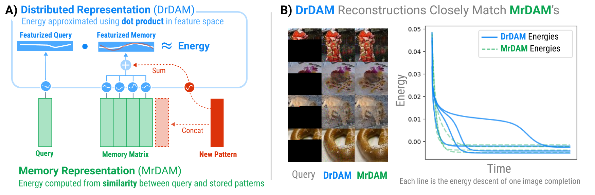

# Distributed Representations for Dense Associative Memory (**DrDAM**)

> Codebase accompanying the NeurIPS 2024 paper ["Distributed Memory through the Lens of Random Features"]()

**DrDAM** is the first technique to show how memories can be distributed in Dense Associative Memories (DenseAMs), much like how memories were distributed in the original Hopfield network. The traditional **Memory Representation for Dense Associative Memory (MrDAM)** is a "slot-based" associative memory where each memory is represented as a "slot" (i.e., row or column) of a weight matrix. New memories are added by concatenating a new vector to an existing weight matrix. DrDAM takes advantage of Random Features to store patterns via summation into a weight tensor of constant size rather than concatenation. See Figure 1 below (from the paper) for an illustration. DrDAM closely approximates both the energy and fixed-point dynamics of the traditional **M**emory **R**epresentation for **D**ense **A**ssociative **M**emory (MrDAM) while having a parameter space of constant size.

<figure>
  
  <figcaption>Figure 1: The Distributed Representation for Dense Associative Memory (DrDAM) approximates both the energy and fixed-point dynamics of the traditional Memory Representation for Dense Associative Memory (MrDAM) while having a parameter space of constant size.</figcaption>
</figure>

This repository contains the code for recreating all experiments of the main paper. Unless otherwise noted, all reported results were created on a single L40s GPU with ~48GB of VRAM.

## Installation
```bash
conda env create -f environment.yml
conda activate distributed_DAM
pip install -r requirements.txt
pip install --upgrade "jax[cuda12]" # Match CUDA version to your GPU
make data # Download data. Takes ~10 min depending on internet speed
```

## Experiment Descriptions

We follow a "shallow" directory structure that obviates the need for submodules and editable pip installations. Run all commands from the root directory.

### (Fig 1) "Pure INFerence on Tiny Imagenet" [PINF]

Recreate the trajectories shown in the right half of Fig 1 of our paper by running the following code:

```
python exp_PINF.py fig1
```

- Runs on GPU 0 by default.
- Output figures saved in `figs/PINF`

### (Fig 2) "Pure INFerence on Tiny Imagenet: compression" [PINF2]

(used an A100 with 80GB of VRAM for this experiment)

```
python exp_PINF.py fig2
```

- Runs on GPU 0 by default.
- Output figure saved in `figs/PINF2`

### (Fig 3, Fig 4A) "QUANTitative experiments across `Y`" [QUANT1b]

(experiment takes several days as currently implemented) Data is first analyzed across a wide range of configurations. Note that `m` is our old notation for `Y` in the paper.

```
python exp_QUANT1b_opt_retrieval.py --betas 10 30 40 50 --ms 5000 40000 80000 120000 160000 200000 300000 400000 500000 --outdir results/QUANT1b_near_0.1_retrieval --do_retrieval
```

- Runs on GPU 1 by default
- Saves data to `results/QUANT1b_near_0.1_retrieval`

Once the data is generated, we analyze it for Figs 3 and 4A.

**(Fig 3)**: `python eval_QUANT1b_no_retrieval+bounds.py`

**(Fig 4A)**: `python eval_QUANT1b_retrieval.py`

- Saves figures to `figs/QUANT1b`

### (Fig 4B) "QUALitative experiments on CIFAR" [QUAL1]

(experiment takes ~10 minutes)

``` 
python exp_QUAL1__qualitative_imgs.py
```

- Output figure saved in `figs/QUAL1`

### (Fig 5) "QUANTitative experiments across `K`" [QUANT1c]

```
python exp_QUANT1c.py
```

- Runs on GPU 1 by default

**(Fig 5)**: `python eval_QUANT1c.py`

- Saves figures to `figs/QUANT1c`

### (Fig 6) "QUANTitative experiments on Kernel Ablations" [QUANT2]

```
python exp_QUANT2__kernel_ablations.py
python eval_QUANT2__kernel_ablations.py
```

- Runs on CPU by default
- Saves figures to `figs/QUANT2`